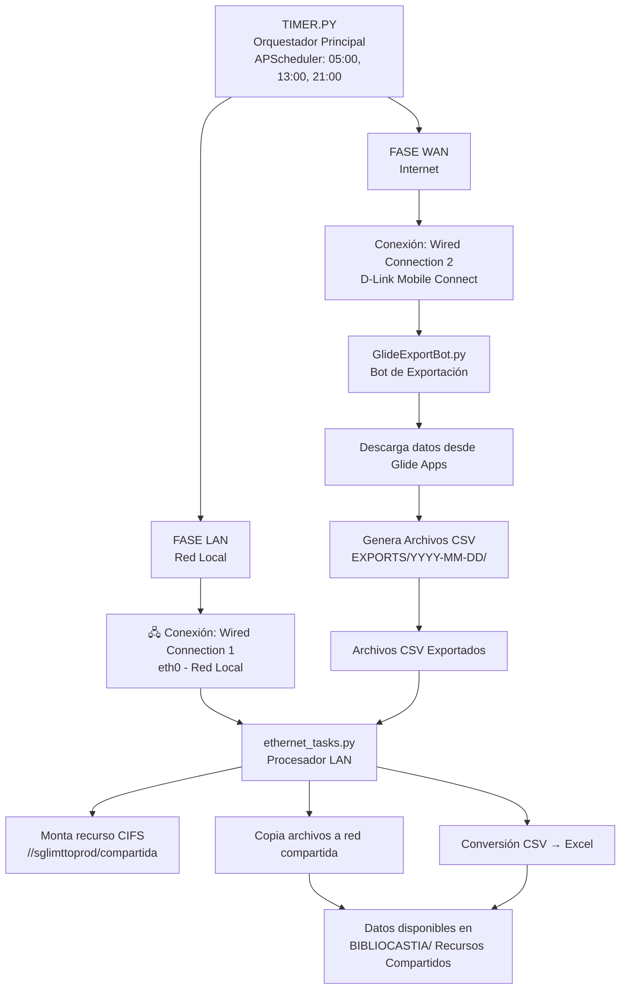
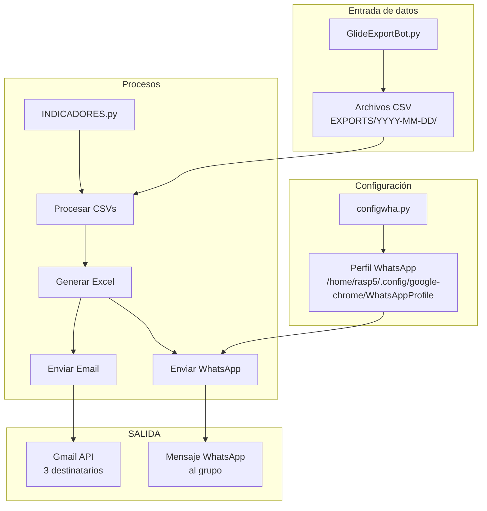
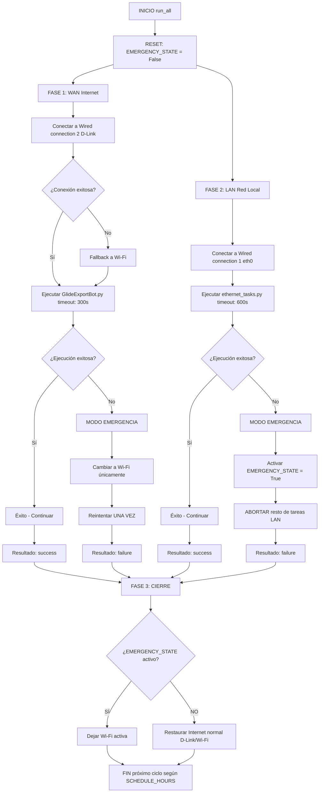
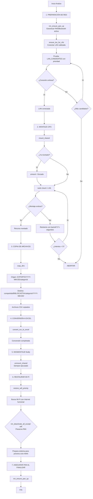
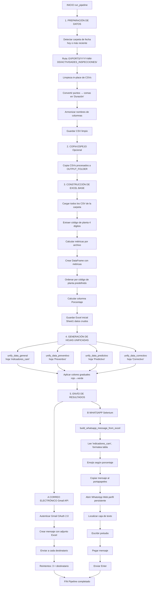
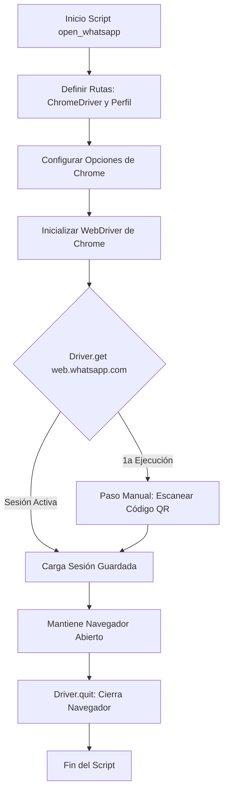

# 1. Resumen Ejecutivo

El sistema de **Bibliocastia** es una solución automatizada diseñada para la gestión y sincronización de datos en un entorno **Raspberry Pi**.

Este sistema opera de manera continua y utiliza un **Orquestador (`Timer.py`)** basado en **APScheduler** para gestionar la ejecución de tareas críticas. además de esto, existen scripts auxiliares para generar reportes y preparar la configuración de WhatsApp.

El orquestador alterna la conectividad de red entre **WAN (Internet)** y **LAN (Red Local)** para ejecutar dos procesos principales:

**Tarea WAN**

- **Script:** `GlideExportBot.py`
- **Conexión:** *Wired connection 2* (D-Link)  

**Tarea LAN**

- **Script:** `ethernet_tasks.py`
- **Conexión:** *Wired connection 1* (eth0)  

---

## 1.1 Programación de Ejecución

Las tareas se ejecutan automáticamente en ciclos **tres veces al día**, según la programación definida en la variable `SCHEDULE_HOURS`.

## 1.2 Alta Disponibilidad y Resiliencia

Además de la programación, el sistema incorpora lógica de alta disponibilidad y resiliencia, incluyendo:

- Mecanismos de reintentos de conexión  
- **Fallback** a Wi-Fi  
- Un **Modo de Emergencia** que se activa automáticamente ante cualquier fallo en las tareas críticas  

Esto asegura la **continuidad de la operación** o deja el sistema en un **estado conocido y seguro**.

## Nota

> **APScheduler (Advanced Python Scheduler)** es una biblioteca de Python que permite programar la ejecución de funciones (tareas o "jobs") para que se ejecuten más tarde, ya sea una sola vez o de forma periódica.  
>  
> Es ideal para automatizar tareas dentro de aplicaciones Python existentes, como el código del Orquestador, sin depender de herramientas externas del sistema operativo como **cron**.

---

## 1.3 Componentes Principales
### Timer.py

- **Tipo:** Orquestador
- **Descripción:** Coordina la ejecución de todos los procesos, gestión de red, reintentos y modo emergencia.
- **Ubicación:** `/home/rasp5/Desktop/BIBLIOCASTIA/NOOTEBOKS/timer.py`
- **Conexión:** WAN / LAN / Wi-Fi (Fallback)

### GlideExportBot.py

- **Tipo:** Bot de Exportación
- **Descripción:** Extrae datos desde Glide a través de Internet. 
- **Ubicación:** `/home/rasp5/Desktop/BIBLIOCASTIA/NOOTEBOKS/GlideExportBot.py`
- **Conexión:** WAN (Wired connection 2)

### Ethernet_tasks.py

- **Tipo:** Manipulación de Archivos
- **Descripción:** Procesa archivos en la red local/CIFS: transferir, organizar y convertir archivos de datos.
- **Ubicación:** `/home/rasp5/Desktop/BIBLIOCASTIA/NOOTEBOKS/ethernet_tasks.py`
- **Conexión:** LAN (Wired connection 1)

### Indicadores.py

- **Tipo:** Script Auxiliar
- **Descripción:** Consolida y reporta datos de mantenimiento. Convierte archivos CSV exportados en indicadores para la toma de decisiones.
- **Ubicación:** `/home/rasp5/Desktop/BIBLIOCASTIA/NOOTEBOKS/indicadores.py`
- **Conexión:** WAN / LAN

### Configwha.py

- **Tipo:** Script Auxiliar
- **Descripción:** Prepara y mantiene una sesión activa de WhatsApp Web en la máquina.
- **Ubicación:** `/home/rasp5/Desktop/BIBLIOCASTIA/NOOTEBOKS/configwha.py`
- **Conexión:** WAN

## 1.4 Diagrama de flujo de datos entre componentes

### 1.4.1 Timer.Py , GlideExportBot.py y Ethernet_task.py


### 1.4.2  GlideExportBot.py, Indicadores.py y configwha.py


## 1.5 Dependencias externas y requerimientos del sistema

### 1.5.1 Librerías Python (instalar con pip)

| **Librería**                 | **Versión** | **¿Para qué sirve?**                                                     | **Comando de Instalación**                     |
|------------------------------|-------------|---------------------------------------------------------------------------|------------------------------------------------|
| APScheduler                  | 3.10.4      | Programar tareas automáticas (ciclo diario).                              | `pip install APScheduler==3.10.4`              |
| pytz                         | 2024.1      | Manejar zona horaria de Colombia.                                         | `pip install pytz==2024.1`                     |
| Selenium                     | (última)    | Automatización web (exportación en Glide y envío de WhatsApp).            | `pip install selenium`                         |
| google-api-python-client     | (última)    | Enviar correos y obtener enlaces de inicio de sesión con Gmail API.       | `pip install google-api-python-client`         |
| google-auth-oauthlib         | (última)    | Manejar el flujo de autenticación Oauth2 de Google.                       | `pip install google-auth-oauthlib`             |
| pyperclip                    | (última)    | Copiar texto al portapapeles (para WhatsApp Web).                         | `pip install pyperclip`                        |
| pandas                       | (última)    | Lectura, manipulación y cálculo de indicadores (conversión CSV a XLSX).   | `pip install pandas`                           |
| openpyxl                     | (última)    | Permite a Pandas y scripts manipular archivos `.xlsx`.                    | `pip install openpyxl`                         |
| numpy                        | (última)    | **NUEVO** — Refuerza operaciones numéricas y condicionales en Pandas.     | `pip install numpy`                            |

### 1.5.2 Programas del Sistema (instalar con apt)

| **Componente**        | **Versión**           | **¿Para qué sirve?**                                                                 | **Comando de Instalación / Configuración**                                         |
|-----------------------|------------------------|----------------------------------------------------------------------------------------|--------------------------------------------------------------------------------------|
| Python                | 3.9 o superior         | Lenguaje de programación principal.                                                    | `sudo apt install python3.9 python3-pip`                                             |
| NetworkManager (nmcli)| Cualquiera              | Controla las conexiones de red (WAN, LAN, Wi-Fi).                                      | `sudo apt install network-manager`                                                   |
| python3-tk            | Cualquiera              | Interfaz gráfica con botones (opcional).                                               | `sudo apt install python3-tk`                                                        |
| sudo                  | -                      | Permisos para cambiar conexiones de red.                                               | Configurar permisos para nmcli en `/etc/sudoers.d/nmcli`.                            |
| Chromedriver          | (coincidir con Chrome) | Controlador que permite a Selenium automatizar el navegador Chrome.                     | `sudo apt install chromium-chromedriver`                                              |
| Google Chrome         | (última)               | Navegador web real que Chromedriver controla.                                          | `sudo apt install google-chrome-stable` (o `chromium-browser`)                        |
| cifs-utils            | Cualquiera              | **NUEVO:** Permite usar `mount -t cifs` para montar recursos compartidos (Samba/Windows). | `sudo apt install cifs-utils`                                                         |

---

# 2. Orquestador principal - Timer.py

El script **timer.py** (Orquestador) es el componente central de control que se encarga de:

- Programar la ejecución automática de tareas (Glide y Ethernet) en horas predefinidas (5:00, 13:00 y 21:00).

- Gestionar la conectividad de red (WAN/LAN/Wi-Fi) de forma explícita antes de ejecutar cada tarea.

- Implementar una lógica de Modo de Emergencia para manejar fallas en las tareas o problemas de conexión a Internet.


## 2.1 Flujo de Ejecución del Ciclo



## 2.2 Modo de Emergencia
El Modo de Emergencia (EMERGENCY_STATE) se activa ante cualquier falla crítica.
- Fallo en tarea WAN (GlideExportBot.py)
- Fallo en tarea LAN (ethernet_tasks.py)
- Imposibilidad de conectar a LAN
- Excepción no controlada en el ciclo

**Activación (trigger_emergency):**

- Marca la bandera global EMERGENCY_STATE = True.

- Crea un archivo (/tmp/orchestrator.emergency) con la razón de la falla.

- Fuerza la conexión a Internet por Wi-Fi (ignorando D-Link y la LAN) para garantizar la comunicación mínima.

- Efecto: Una vez activo, el modo de emergencia influye en el reintento de tareas WAN, en la interrupción inmediata de tareas LAN y en el estado de red final del sistema.

## 2.2.1 **Impacto en el flujo**

### WAN (Internet)

**Sin emergencia**
- Utiliza la conexión D-Link.
- Si falla, hace fallback a Wi-Fi y realiza 1 reintento.

**Con emergencia**
- Usa únicamente Wi-Fi y también realiza 1 reintento.

### LAN (Red Local)

**Sin emergencia**
- Ejecuta todas las tareas programadas en la red local.

 **Con emergencia**
- Se abortan inmediatamente todas las tareas LAN restantes.

### Cierre del ciclo

**Sin emergencia**
- Se restablece el Internet normal (D-Link/Wi-Fi).

**Con emergencia**
- La máquina queda funcionando únicamente con Wi-Fi.

## 2.3 Inferfaz manual (GUI)

Dos modos de ejecución manual:

### **Ejecución Selectiva**
- Elige qué tareas correr (Glide y/o EthernetTasks)
- Respeta lógica de red y emergencia

### **Ejecución Completa Segura**
- Pausa el scheduler automático temporalmente
- Ejecuta ciclo completo **SIN** solaparse con automático
- Reactiva scheduler después

---
# 3. Glideexportbot.py - exportador WAN

Es un script de Python que realiza un proceso automatizado completo para extraer datos de Glide Apps, exportarlos a archivos CSV, organizarlos, comprimirlos en archivos ZIP y, finalmente, enviar esos ZIPs por correo electrónico (Gmail) y un resumen del proceso por WhatsApp Web, utilizando Selenium WebDriver para interactuar con la interfaz web.

## 3.1 Funcionalidades claves

### 3.1.1 Gestión de Red con Fallback (nmcli)

- Intenta conectarse a una conexión WAN cableada (**Wired connection 2**) varias veces.
- Si falla, prueba con las redes Wi-Fi conocidas como mecanismo de fallback.
- Preserva las conexiones PAN/Bluetooth durante los cambios de red, asegurando que no se desconecten.
- Incluye lógica para forzar servidores DNS públicos (**Cloudflare/Google**) si la resolución inicial falla.

### 3.1.2 Web Scraping y Automatización (Selenium)

- Automatiza el inicio de sesión en Glide enviando un correo al bot y extrayendo el enlace mágico (Enlace unico) del buzón de Gmail.
- Maneja el modal "This app is open in another tab" haciendo clic automáticamente en "Open app here".
- **Datos a exportar**:
**Plantas (18)**

```python
pythonplants = [
    "0002_GASCOL CENTRO", "0011_GASCOL SUR", "0021_G. LUX BOGOTÁ",
    "0079_BELLO", "0092_MEDELLÍN", "0111_MALAMBO",
    "0198_POSTOBÓN PEREIRA", "0381_G. LUX MONTERÍA", "0385_NEIVA",
    "0393_VILLAVICENCIO", "0395_G. LUX PASTO", 
    "0398_G. LUX VILLAVICENCIO", "0410_YUMBO", 
    "0422_G. LUX PIEDECUESTA", "0438_CÚCUTA",
    "0441_G. LUX DUITAMA", "0445_NGB", "0447_G. LUX VALLEDUPAR"
]
```
**Secciones por Planta (5)**
```python
pythonsections = [
    "AVISOM2",          # Avisos de mantenimiento tipo 2
    "ACTIVIDADES",      # Actividades de mantenimiento
    "INSPECCIONES",     # Inspecciones realizadas
    "AVISOM1",          # Avisos de mantenimiento tipo 1
    "Users"             # Usuarios del sistema
]
```

###  3.1.3Manejo de Archivos y Correo Electrónico (Gmail API)

- Utiliza la API de Gmail para la autenticación y el envío de correos electrónicos con archivos adjuntos.  
- Organiza los archivos .csv descargados en directorios específicos según la sección (AVISOS_M1, AVISOS_M2, ACTIVIDADES_INSPECCIONES, USERS).  
- Comprime los directorios en archivos .zip y los envía a una lista predefinida de destinatarios.

### 3.1.4 Notificación Final (WhatsApp Web)

- Genera un resumen detallado de las exportaciones exitosas y fallidas.  
- Intenta enviar este resumen a través de WhatsApp Web utilizando Selenium, pegando el contenido del portapapeles en un chat predefinido.

## 3.2 Ubicación de exportaciones

Después de la descarga, la función organizar_y_comprimir mueve y estructura estos archivos CSV en directorios basados en la fecha de ejecución y la sección del dato.

La estructura final se crea dentro del directorio EXPORTS dentro de Downloads:

Raíz de Exportación: /home/rasp5/Downloads/EXPORTS

Dentro de esa raíz, se crea una carpeta con la fecha actual (ej. 2025-11-18), y dentro de ella, los datos se separan por categoría:

| Tipo de Dato               | Directorio Final Organizado                                           |
|----------------------------|----------------------------------------------------------------------|
| ACTIVIDADES e INSPECCIONES | /home/rasp5/Downloads/EXPORTS/2025-11-18/ACTIVIDADES_INSPECCIONES   |
| AVISOM1                     | /home/rasp5/Downloads/EXPORTS/2025-11-18/AVISOS_M1                  |
| AVISOM2                     | /home/rasp5/Downloads/EXPORTS/2025-11-18/AVISOS_M2                  |
| Users                       | /home/rasp5/Downloads/EXPORTS/2025-11-18/USERS                      |


## 3.3 Flujo Completo del Proceso

```mermaid
graph TD
    A[INICIO main] --> B[PASO 1: PREPARACIÓN DE RED]
    
    B --> C[Asegurar PAN/Bluetooth ARRIBA]
    C --> D[nm_ensure_pan_up]
    
    D --> E[Conectar Internet con fallback]
    E --> F{Intentar Wired connection 2 D-Link}
    F -->|Éxito| G[Verificar DNS y conectividad IP]
    F -->|Falla| H[Probar perfiles Wi-Fi]
    H --> G
    
    G --> I{internet_by_ip y DNS resuelven?}
    I -->|Sí| J[ Red lista]
    I -->|No| K[Forzar DNS públicos 1.1.1.1, 8.8.8.8]
    K --> L[Reintentos con backoff hasta 5 intentos]
    L --> I
    
    J --> M[PASO 2: AUTENTICACIÓN GMAIL]
    M --> N{Cargar token.pickle}
    N -->|Existe y válido| O[Retorna gmail_service]
    N -->|No existe o expirado| P[OAuth flow con credentials.json]
    P --> Q[Guardar nuevo token]
    Q --> O
    
    O --> R[PASO 3: INICIAR SELENIUM]
    R --> S[Configurar Chrome Options]
    S --> T[Iniciar WebDriver]
    T --> U[WebDriverWait 30 segundos]
    
    U --> V[PASO 4: AUTENTICACIÓN EN GLIDE]
    V --> W[Navegar a https://go.glideapps.com]
    W --> X[Manejar advertencias de seguridad]
    X --> Y[Click Sign up with Email]
    Y --> Z[Ingresar SENDER_EMAIL]
    Z --> AA[Esperar correo de Glide Gmail API]
    AA --> BB[extract_link_from_email 10 intentos × 10s]
    BB --> CC[Obtener enlace mágico]
    CC --> DD[Abrir enlace en nueva pestaña]
    DD --> EE{Manejar modal Open app here?}
    EE -->|Aparece| FF[click_open_app_here_if_present]
    EE -->|No aparece| GG[Continuar]
    FF --> GG
    
    GG --> HH[PASO 5: EXPORTACIÓN POR PLANTA Loop 18 plantas]
    HH --> II[Para cada PLANTA]
    II --> JJ[Navegar a planta específica]
    JJ --> KK[Ir a pestaña Data]
    KK --> LL[Para cada SECCIÓN 5 secciones]
    
    LL --> MM[export_section driver, wait, section, plant]
    MM --> NN{Buscar panel section plant}
    NN -->|Encontrado| OO[Click botón Export]
    NN -->|No encontrado| PP[ Marcar fallo]
    OO --> QQ[Esperar descarga inicial]
    QQ --> RR[Click Select All]
    RR --> SS[Click Export final]
    SS --> TT[Esperar descarga completa]
    TT --> UU{wait_for_downloads sin .crdownload}
    UU -->|Éxito| VV[ Success]
    UU -->|Fallo| WW[Retry 2 intentos]
    WW --> OO
    
    VV --> XX[Registrar en summary_of_exports]
    PP --> XX
    XX --> YY{¿Todas las secciones?}
    YY -->|No| LL
    YY -->|Sí| ZZ[Contabilizar éxitos: success_count]
    
    ZZ --> AAA{success_count == 5?}
    AAA -->|Sí| BBB[plants_succeeded.append plant]
    AAA -->|No| CCC[plants_failed.append plant]
    
    BBB --> DDD[Volver al inicio de Glide]
    CCC --> DDD
    DDD --> EEE{¿Todas las plantas?}
    EEE -->|No| II
    EEE -->|Sí| FFF[FIN Loop de plantas]
    
    FFF --> GGG[PASO 6: ORGANIZACIÓN Y COMPRESIÓN]
    GGG --> HHH[organizar_y_comprimir gmail_svc]
    HHH --> III[Crear estructura de carpetas EXPORTS/YYYY-MM-DD/]
    III --> JJJ[Clasificar y mover CSV según nombre]
    JJJ --> KKK[Crear 4 archivos ZIP uno por carpeta]
    KKK --> LLL[Enviar correos con ZIP adjuntos]
    LLL --> MMM[_send_email_batch a cada RECIPIENT]
    MMM --> NNN[ Archivos organizados y enviados]
    
    NNN --> OOO[PASO 7: RESUMEN A WHATSAPP]
    OOO --> PPP[Preparar mensaje con resumen]
    PPP --> QQQ[plantas exitosas, fallidas, archivos]
    QQQ --> RRR[Copiar mensaje al portapapeles pyperclip]
    RRR --> SSS[Asegurar PAN/Bluetooth ARRIBA nuevamente]
    SSS --> TTT[Abrir WhatsApp Web perfil persistente]
    TTT --> UUU[Navegar a link de grupo/chat]
    UUU --> VVV[Escribir enviando datos ...]
    VVV --> WWW[Pegar mensaje Ctrl+V]
    WWW --> XXX[Enviar Enter]
    XXX --> YYY[Cerrar navegador WhatsApp]
    
    YYY --> ZZZ[FIN]
    ZZZ --> AAAA[Asegurar PAN/Bluetooth ARRIBA al finalizar]

```


---
# 4. Ethernet_tasks.py - procesador lan
Procesa los archivos CSV exportados por GlideExportBot.py, montando un recurso compartido CIFS en red local (LAN), copiando archivos, convirtiéndolos a Excel y organizándolos por fecha.

## 4.1 Funcionalidades claves

### 4.1.1 Gestión de Red

- **Bloqueo de Instancias (acquire_lock):** Asegura que solo una instancia del script se ejecute a la vez utilizando.

- **Asegurar PAN/Bluetooth:** Utiliza nmcli (NetworkManager) para asegurar que una conexión cableada (ensure_lan_for_cifs, PAN) o una conexión Bluetooth esté activa al inicio y al final, preservando dichas conexiones durante las operaciones de red.

- **Asegurar LAN (Cableada):** Llama a nm_ensure_pan_up para garantizar que el acceso remoto (Bluetooth/PAN) esté activo antes de modificar la red. Esto es crucial porque el montaje CIFS (Samba) requiere generalmente una conexión de red local y estable.

### 4.1.2 Montaje y Acceso al Servidor
Montar CIFS/Samba: Utiliza el comando sudo mount -t cifs para montar un recurso compartido de red (//sglimttoprod/compartida) en el punto de montaje local (/home/rasp5/compartida).

### 4.1.3 Procesamiento de Archivos

Copia de Directorios (copy_dirs): Recorre los directorios de exportación generados por el bot de Glide (por ejemplo, /home/rasp5/Downloads/EXPORTS/2025-11-18/AVISOS_M1) y copia los archivos a las rutas finales en el servidor:

- /home/rasp5/compartida/BIBLIOCASTIA/AVISOS M1/<fecha>

- /home/rasp5/compartida/BIBLIOCASTIA/AVISOS M2/<fecha>

- /home/rasp5/compartida/BIBLIOCASTIA/ACTIVIDADES_INSPECCIONES/<fecha>

Conversión CSV a Excel (convert_csv_to_excel): Utiliza la librería pandas para leer cada archivo .csv copiado y crear una copia idéntica en formato .xlsx dentro de la carpeta del servidor.

### 4.1.4 Limpieza y Restauración

- **Desmontar CIFS/Samba:** Una vez completada la transferencia y conversión, desmonta el recurso compartido (sudo umount /home/rasp5/compartida) para liberar el punto de montaje.

- **Restaurar Wi-Fi:** Intenta restaurar la conexión Wi-Fi con Internet activo (restore_wifi_priority) para dejar el sistema en el estado de red más común después de las tareas por cable.

### 4.2 Flujo Completo del Proceso



# 5. Indicadores.py - análisis y reportes
Procesa los archivos CSV, calcula indicadores de mantenimiento (KPIs), genera reportes Excel con múltiples hojas y envía resultados por Gmail y WhatsApp.

El código completo implementa un Pipeline de Automatización de Indicadores de Mantenimiento (CAM). Su objetivo principal es:

- Ingesta (E): Leer archivos CSV exportados de un sistema (probablemente SAP o similar).

- Transformación (T): Estandarizar, limpiar y calcular más de una docena de métricas de horas/duración, desglosadas por planta (Código Único) y por tipo de mantenimiento (Preventivo, Predictivo, Correctivo).

- Carga y Distribución (L): Generar un informe final en Excel y distribuir un resumen por correo electrónico (Gmail) y un aviso de cumplimiento por mensajería instantánea (WhatsApp).


## Fase 1: Configuración y Preparación del Entorno

Se establecen las bases para la ejecución:

### Rutas de Archivos
- Se definen las carpetas de entrada (`ROOT_FOLDER`, `SUBFOLDER`) y salida (`OUTPUT_FOLDER`) en un entorno Linux.

### Conectividad
- **WhatsApp / Selenium:** Rutas del driver de Chrome y el perfil de usuario.  
- **Gmail:** Credenciales, alcance (`SCOPES`) y lista de destinatarios (`RECIPIENTS`).

### Utilidades
- Se inicializan funciones de ayuda para la gestión de rutas:
  - `get_latest_date_folder`
  - `best_chromedriver`


---

## Fase 2: Limpieza y Normalización de Datos

Esta fase asegura que los datos CSV sean consistentes, independientemente de cómo se hayan exportado:

### Lectura Robusta
- `leer_csv_robusto` prueba múltiples combinaciones de separador y codificación (`;` o `,` / `utf-8` o `latin-1`).

### Armonización de Columnas
- `armonizar_columnas` estandariza los encabezados (ejemplo: `duracion` a `Duración`).

### Normalización de Valores
- `convertir_a_flotante` convierte la columna **Duración** a números decimales flotantes, manejando errores como comas decimales.

### Tipo de Mantenimiento
- `tipo_equivalente` clasifica cada fila como:
  - Correctivo  
  - Preventivo  
  - Predictivo  
  Basándose en códigos (como `PMXX`) o texto.

### Preprocesamiento In-Place
- `process_csv_files_inplace` limpia nombres de archivo y reemplaza puntos por comas en la columna **Duración** del CSV original.


---

## Fase 3: Cálculo y Consolidación de Indicadores

La función central `construir_excel_indicadores` realiza el procesamiento y la agregación de métricas:

### Extracción de Métricas
- Itera sobre cada CSV y llama a más de una docena de funciones de suma:
  - `sumar_duracion`
  - `duracion_tipo_preventivo_o_total`
  - `calcular_duracion_programada`
  - …entre muchas otras.

### Construcción del DataFrame Base
- Se consolidan todos los resultados en un DataFrame (`df_resultados`).

### Ordenamiento
- Se ordenan las filas según una lista predefinida de **Códigos Únicos** (plantas / áreas).

### Generación de Sheet1
- Guardado del DataFrame como la hoja inicial del archivo Excel.


---

## Fase 4: Generación y Formato de Informes Unificados (Excel)

Las funciones `unify_data_*` (general, preventivo, predictivo, correctivo) refinan el Excel:

### Agregación por Código
- Agrupan y suman métricas de **Sheet1** por **Código Único**, generando un resumen por planta.

### Hojas Específicas
- Crean hojas separadas:
  - `indicadores_cam` (general)
  - `indicadores_cam_Preventivo`
  - `indicadores_cam_Predictivo`
  - `indicadores_cam_Correctivo`

### Formato Condicional
- Utilizando **openpyxl**, se aplica un relleno de color (rojo → verde) a la columna **Porcentaje**, facilitando la lectura del rendimiento.


---

## Fase 5: Distribución Automatizada de Resultados

El código finaliza el proceso notificando a los usuarios:

### Correo Electrónico (Gmail)
- `authenticate_gmail` establece la conexión segura.  
- `enviar_resultados_indicadores` envía el correo a los destinatarios definidos, adjuntando el archivo Excel.

### Mensaje de WhatsApp (Selenium)
- `build_whatsapp_message_from_excel` lee la hoja `indicadores_cam` y construye un mensaje corto con emojis de estado
- `enviar_whatsapp_misma_forma` abre WhatsApp Web con Selenium, copia el mensaje y lo envía al grupo predefinido.

---

### 5.1 Flujo Completo del Proceso

# 6. configwha.py - perfil de sesión

configwha.py es un script auxiliar especializado en la gestión y configuración del cliente de WhatsApp Web mediante Selenium. Su función principal es proporcionar una interfestructura estable y persistente para las comunicaciones vía WhatsApp del sistema BIBLIOCASTIA.

## 6.1 Funcionalidades claves

- Inicializar sesión persistente de WhatsApp Web

- Mantener autenticación entre ejecuciones

- Proveer configuración reutilizable para otros componentes

- Gestionar perfil de usuario específico para WhatsApp



