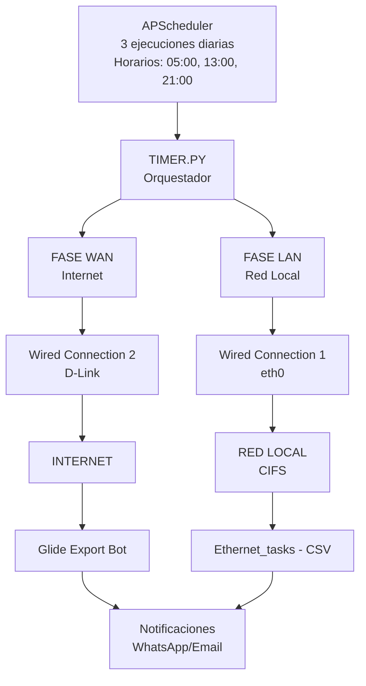
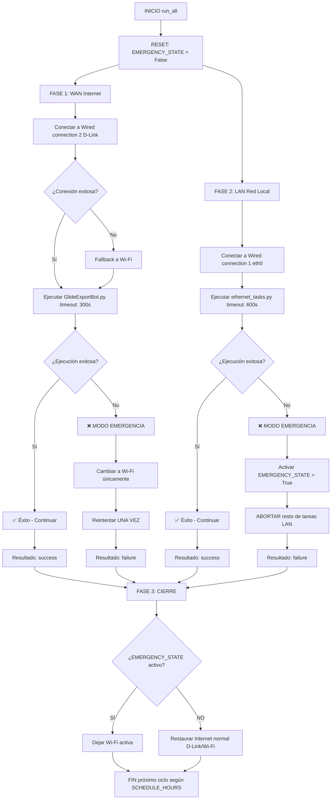

# 1. Resumen Ejecutivo

El sistema de **Bibliocastia** es una solución automatizada diseñada para la gestión y sincronización de datos en un entorno **Raspberry Pi**.

Este sistema opera de manera continua y utiliza un **Orquestador (`Timer.py`)** basado en **APScheduler** para gestionar la ejecución de tareas críticas. además de esto, existen scripts auxiliares para generar reportes y preparar la configuración de WhatsApp.

El orquestador alterna la conectividad de red entre **WAN (Internet)** y **LAN (Red Local)** para ejecutar dos procesos principales:

**🌐 Tarea WAN**

- **Script:** `GlideExportBot.py`
- **Conexión:** *Wired connection 2* (D-Link)  

**🖧 Tarea LAN**

- **Script:** `ethernet_tasks.py`
- **Conexión:** *Wired connection 1* (eth0)  

---

## 1.1 Programación de Ejecución

Las tareas se ejecutan automáticamente en ciclos **tres veces al día**, según la programación definida en la variable `SCHEDULE_HOURS`.

## 1.2 Alta Disponibilidad y Resiliencia

Además de la programación, el sistema incorpora lógica de alta disponibilidad y resiliencia, incluyendo:

- Mecanismos de reintentos de conexión  
- **Fallback** a Wi-Fi  
- Un **Modo de Emergencia** que se activa automáticamente ante cualquier fallo en las tareas críticas  

Esto asegura la **continuidad de la operación** o deja el sistema en un **estado conocido y seguro**.

## Nota

> **APScheduler (Advanced Python Scheduler)** es una biblioteca de Python que permite programar la ejecución de funciones (tareas o "jobs") para que se ejecuten más tarde, ya sea una sola vez o de forma periódica.  
>  
> Es ideal para automatizar tareas dentro de aplicaciones Python existentes, como el código del Orquestador, sin depender de herramientas externas del sistema operativo como **cron**.

---

## 1.3 Diagrama de Arquitectura General

## 1.4 Componentes Principales
### Timer.py

- **Tipo:** Orquestador
- **Descripción:** Coordina la ejecución de todos los procesos, gestión de red, reintentos y modo emergencia.
- **Ubicación:** `/home/rasp5/Desktop/BIBLIOCASTIA/NOOTEBOKS/timer.py`
- **Conexión:** WAN / LAN / Wi-Fi (Fallback)

### GlideExportBot.py

- **Tipo:** Bot de Exportación
- **Descripción:** Extrae datos desde Glide a través de Internet. 
- **Ubicación:** `/home/rasp5/Desktop/BIBLIOCASTIA/NOOTEBOKS/GlideExportBot.py`
- **Conexión:** WAN (Wired connection 2)

### Ethernet_tasks.py

- **Tipo:** Manipulación de Archivos
- **Descripción:** Procesa archivos en la red local/CIFS: transferir, organizar y convertir archivos de datos.
- **Ubicación:** `/home/rasp5/Desktop/BIBLIOCASTIA/NOOTEBOKS/ethernet_tasks.py`
- **Conexión:** LAN (Wired connection 1)

### Indicadores.py

- **Tipo:** Script Auxiliar
- **Descripción:** Consolida y reporta datos de mantenimiento. Convierte archivos CSV exportados en indicadores para la toma de decisiones.
- **Ubicación:** `/home/rasp5/Desktop/BIBLIOCASTIA/NOOTEBOKS/indicadores.py`
- **Conexión:** WAN / LAN

### Configwha.py

- **Tipo:** Script Auxiliar
- **Descripción:** Prepara y mantiene una sesión activa de WhatsApp Web en la máquina.
- **Ubicación:** `/home/rasp5/Desktop/BIBLIOCASTIA/NOOTEBOKS/configwha.py`
- **Conexión:** WAN

---

# 2. Orquestador principal - Timer.py

El script **timer.py** (Orquestador) es el componente central de control que se encarga de:

- Programar la ejecución automática de tareas (Glide y Ethernet) en horas predefinidas (5:00, 13:00 y 21:00).

- Gestionar la conectividad de red (WAN/LAN/Wi-Fi) de forma explícita antes de ejecutar cada tarea.

- Implementar una lógica de Modo de Emergencia para manejar fallas en las tareas o problemas de conexión a Internet.


## 2.1 Flujo de Ejecución del Ciclo



## 2.2 Modo de Emergencia
El Modo de Emergencia (EMERGENCY_STATE) se activa ante cualquier falla crítica.
- Fallo en tarea WAN (GlideExportBot.py)
- Fallo en tarea LAN (ethernet_tasks.py)
- Imposibilidad de conectar a LAN
- Excepción no controlada en el ciclo

**Activación (trigger_emergency):**

- Marca la bandera global EMERGENCY_STATE = True.

- Crea un archivo (/tmp/orchestrator.emergency) con la razón de la falla.

- Fuerza la conexión a Internet por Wi-Fi (ignorando D-Link y la LAN) para garantizar la comunicación mínima.

- Efecto: Una vez activo, el modo de emergencia influye en el reintento de tareas WAN, en la interrupción inmediata de tareas LAN y en el estado de red final del sistema.

## 2.2.1 **Impacto en el flujo**

### WAN (Internet)

**Sin emergencia**
- Utiliza la conexión D-Link.
- Si falla, hace fallback a Wi-Fi y realiza 1 reintento.

**Con emergencia**
- Usa únicamente Wi-Fi y también realiza 1 reintento.

### LAN (Red Local)

**Sin emergencia**
- Ejecuta todas las tareas programadas en la red local.

 **Con emergencia**
- Se abortan inmediatamente todas las tareas LAN restantes.

### Cierre del ciclo

**Sin emergencia**
- Se restablece el Internet normal (D-Link/Wi-Fi).

**Con emergencia**
- La máquina queda funcionando únicamente con Wi-Fi.

## 2.3 Inferfaz manual (GUI)

Dos modos de ejecución manual:

### **Ejecución Selectiva**
- Elige qué tareas correr (Glide y/o EthernetTasks)
- Respeta lógica de red y emergencia

### **Ejecución Completa Segura**
- Pausa el scheduler automático temporalmente
- Ejecuta ciclo completo **SIN** solaparse con automático
- Reactiva scheduler después

---
# 3. Glideexportbot.py - exportador WAN

Es un script de Python que realiza un proceso automatizado completo para extraer datos de Glide Apps, exportarlos a archivos CSV, organizarlos, comprimirlos en archivos ZIP y, finalmente, enviar esos ZIPs por correo electrónico (Gmail) y un resumen del proceso por WhatsApp Web, utilizando Selenium WebDriver para interactuar con la interfaz web.

## 3.1 Funcionalidades claves

### 3.1.1 Gestión de Red con Fallback (nmcli)

- Intenta conectarse a una conexión WAN cableada (**Wired connection 2**) varias veces.
- Si falla, prueba con las redes Wi-Fi conocidas como mecanismo de fallback.
- Preserva las conexiones PAN/Bluetooth durante los cambios de red, asegurando que no se desconecten.
- Incluye lógica para forzar servidores DNS públicos (**Cloudflare/Google**) si la resolución inicial falla.

### 3.1.2 Web Scraping y Automatización (Selenium)

- Automatiza el inicio de sesión en Glide enviando un correo al bot y extrayendo el enlace mágico (Enlace unico) del buzón de Gmail.
- Maneja el modal "This app is open in another tab" haciendo clic automáticamente en "Open app here".
- **Datos a exportar**:
**Plantas (18)**

```python
pythonplants = [
    "0002_GASCOL CENTRO", "0011_GASCOL SUR", "0021_G. LUX BOGOTÁ",
    "0079_BELLO", "0092_MEDELLÍN", "0111_MALAMBO",
    "0198_POSTOBÓN PEREIRA", "0381_G. LUX MONTERÍA", "0385_NEIVA",
    "0393_VILLAVICENCIO", "0395_G. LUX PASTO", 
    "0398_G. LUX VILLAVICENCIO", "0410_YUMBO", 
    "0422_G. LUX PIEDECUESTA", "0438_CÚCUTA",
    "0441_G. LUX DUITAMA", "0445_NGB", "0447_G. LUX VALLEDUPAR"
]
```
**Secciones por Planta (5)**
```python
pythonsections = [
    "AVISOM2",          # Avisos de mantenimiento tipo 2
    "ACTIVIDADES",      # Actividades de mantenimiento
    "INSPECCIONES",     # Inspecciones realizadas
    "AVISOM1",          # Avisos de mantenimiento tipo 1
    "Users"             # Usuarios del sistema
]
```

###  3.1.3Manejo de Archivos y Correo Electrónico (Gmail API)

- Utiliza la API de Gmail para la autenticación y el envío de correos electrónicos con archivos adjuntos.  
- Organiza los archivos .csv descargados en directorios específicos según la sección (AVISOS_M1, AVISOS_M2, ACTIVIDADES_INSPECCIONES, USERS).  
- Comprime los directorios en archivos .zip y los envía a una lista predefinida de destinatarios.

### 3.1.4 Notificación Final (WhatsApp Web)

- Genera un resumen detallado de las exportaciones exitosas y fallidas.  
- Intenta enviar este resumen a través de WhatsApp Web utilizando Selenium, pegando el contenido del portapapeles en un chat predefinido.

## 3.2 Flujo Completo del Proceso

```mermaid
graph TD

    A["INICIO main()"] --> B["PASO 1: PREPARACION DE RED"]

    %% PASO 1
    B --> B1["Asegurar PAN/Bluetooth ARRIBA\nnm_ensure_pan_up()"]
    B --> B2["Conectar Internet con fallback"]
    B2 --> B2a["Intentar: Wired connection 2 (D-Link)"]
    B2 --> B2b["Si falla -> Probar Wi-Fi\nensure_internet_with_wifi_fallback()"]
    B --> B3["Verificar DNS y conectividad IP"]
    B3 --> B3a["internet_by_ip() -> 8.8.8.8:53"]
    B3 --> B3b["dns_resolves(oauth2.googleapis.com)"]
    B3 --> B3c["Si falla DNS -> Forzar publicos 1.1.1.1 / 8.8.8.8\nReintentos hasta 5"]
    B --> B4["Red lista / ABORTAR"]

    %% PASO 2
    A --> C["PASO 2: AUTENTICACION GMAIL"]
    C --> C1["Cargar token.pickle"]
    C --> C2["Si no existe o expiro -> OAuth con credentials.json\nGuardar token"]
    C --> C3["Retorna gmail_service"]

    %% PASO 3
    A --> D["PASO 3: INICIAR SELENIUM"]
    D --> D1["Configurar Chrome Options"]
    D --> D2["Iniciar WebDriver"]
    D --> D3["WebDriverWait(30s)"]

    %% PASO 4
    A --> E["PASO 4: AUTENTICACION EN GLIDE"]
    E --> E1["Navegar a go.glideapps.com"]
    E --> E2["Manejar advertencias"]
    E --> E3["Sign up with Email"]
    E --> E4["Ingresar correo"]
    E --> E5["Esperar correo Glide (10 intentos x 10s)"]
    E --> E6["Obtener enlace magico"]
    E --> E7["Abrir enlace en nueva pestaña"]
    E --> E8["Si aparece modal 'Open app here'"]

    %% PASO 5
    A --> F["PASO 5: EXPORTACION POR PLANTA\n(Loop 18 plantas)"]
    F --> F1["Para cada planta"]
    F1 --> F1a["Navegar a planta especifica\n//div[text()='{plant}']"]
    F1 --> F1b["Ir a pesta]()


```

