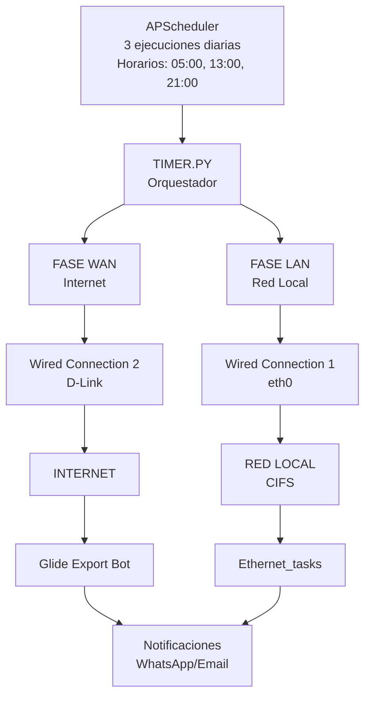

# 1. Resumen Ejecutivo

El sistema de **Bibliocastia** es una solución automatizada diseñada para la gestión y sincronización de datos en un entorno **Raspberry Pi**.

Este sistema opera de manera continua y utiliza un **Orquestador (`Timer.py`)** basado en **APScheduler** para gestionar la ejecución de tareas críticas. además de esto, existen scripts auxiliares para generar reportes y preparar la configuración de WhatsApp.
El orquestador alterna la conectividad de red entre **WAN (Internet)** y **LAN (Red Local)** para ejecutar dos procesos principales:

**🌐 Tarea WAN**

**Script:** `GlideExportBot.py`

**🖧 Tarea LAN**

**Script:** `ethernet_tasks.py`

---

## 1.1 Programación de Ejecución

Las tareas se ejecutan automáticamente en ciclos **tres veces al día**, según la programación definida en la variable `SCHEDULE_HOURS`.

## 1.2 Alta Disponibilidad y Resiliencia

Además de la programación, el sistema incorpora lógica de alta disponibilidad y resiliencia, incluyendo:

- Mecanismos de reintentos de conexión  
- **Fallback** a Wi-Fi  
- Un **Modo de Emergencia** que se activa automáticamente ante cualquier fallo en las tareas críticas  

Esto asegura la **continuidad de la operación** o deja el sistema en un **estado conocido y seguro**.

## Nota

> **APScheduler (Advanced Python Scheduler)** es una biblioteca de Python que permite programar la ejecución de funciones (tareas o "jobs") para que se ejecuten más tarde, ya sea una sola vez o de forma periódica.  
>  
> Es ideal para automatizar tareas dentro de aplicaciones Python existentes, como el código del Orquestador, sin depender de herramientas externas del sistema operativo como **cron**.

---

## 1.3 Diagrama de Arquitectura General

## 1.4 Componentes Principales
### Orquestador Principal

- **Tipo:** Orquestador
- **Descripción:** Coordina la ejecución de todos los procesos, gestión de red, reintentos y modo emergencia.
- **Ubicación:** `/home/rasp5/Desktop/BIBLIOCASTIA/NOOTEBOKS/timer.py`
- **Conexión:** WAN / LAN / Wi-Fi (Fallback)

### GlideExportBot.py

- **Tipo:** Bot de Exportación
- **Descripción:** Extrae datos desde Glide a través de Internet. 
- **Ubicación:** `/home/rasp5/Desktop/BIBLIOCASTIA/NOOTEBOKS/GlideExportBot.py`
- **Conexión:** WAN (Wired connection 2)

### Ethernet_tasks.py

- **Tipo:** Manipulación de Archivos
- **Descripción:** Procesa archivos en la red local/CIFS: transferir, organizar y convertir archivos de datos.
- **Ubicación:** `/home/rasp5/Desktop/BIBLIOCASTIA/NOOTEBOKS/ethernet_tasks.py`
- **Conexión:** LAN (Wired connection 1)

### Indicadores.py

- **Tipo:** Script Auxiliar
- **Descripción:** Consolida y reporta datos de mantenimiento. Convierte archivos CSV exportados en indicadores para la toma de decisiones.
- **Ubicación:** `/home/rasp5/Desktop/BIBLIOCASTIA/NOOTEBOKS/indicadores.py`
- **Conexión:** WAN / LAN

### Configwha.py

- **Tipo:** Script Auxiliar
- **Descripción:** Prepara y mantiene una sesión activa de WhatsApp Web en la máquina.
- **Ubicación:** `/home/rasp5/Desktop/BIBLIOCASTIA/NOOTEBOKS/configwha.py`
- **Conexión:** WAN

# 2. Timer.py

