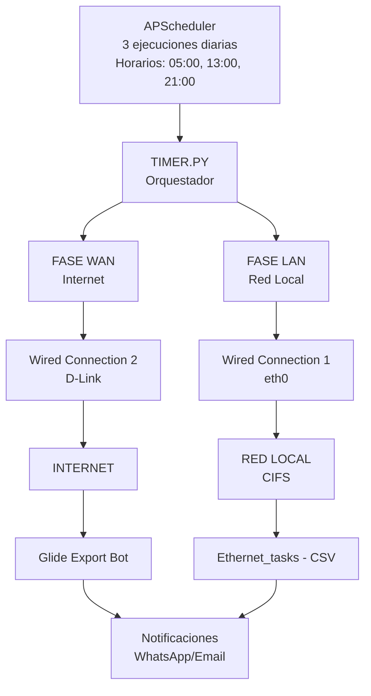

# 1. Resumen Ejecutivo

El sistema de **Bibliocastia** es una solución automatizada diseñada para la gestión y sincronización de datos en un entorno **Raspberry Pi**.

Este sistema opera de manera continua y utiliza un **Orquestador (`Timer.py`)** basado en **APScheduler** para gestionar la ejecución de tareas críticas. además de esto, existen scripts auxiliares para generar reportes y preparar la configuración de WhatsApp.

El orquestador alterna la conectividad de red entre **WAN (Internet)** y **LAN (Red Local)** para ejecutar dos procesos principales:

**🌐 Tarea WAN**

**Script:** `GlideExportBot.py`
**Conexión:** *Wired connection 2* (D-Link)  

**🖧 Tarea LAN**

**Script:** `ethernet_tasks.py`
**Conexión:** *Wired connection 1* (eth0)  

---

## 1.1 Programación de Ejecución

Las tareas se ejecutan automáticamente en ciclos **tres veces al día**, según la programación definida en la variable `SCHEDULE_HOURS`.

## 1.2 Alta Disponibilidad y Resiliencia

Además de la programación, el sistema incorpora lógica de alta disponibilidad y resiliencia, incluyendo:

- Mecanismos de reintentos de conexión  
- **Fallback** a Wi-Fi  
- Un **Modo de Emergencia** que se activa automáticamente ante cualquier fallo en las tareas críticas  

Esto asegura la **continuidad de la operación** o deja el sistema en un **estado conocido y seguro**.

## Nota

> **APScheduler (Advanced Python Scheduler)** es una biblioteca de Python que permite programar la ejecución de funciones (tareas o "jobs") para que se ejecuten más tarde, ya sea una sola vez o de forma periódica.  
>  
> Es ideal para automatizar tareas dentro de aplicaciones Python existentes, como el código del Orquestador, sin depender de herramientas externas del sistema operativo como **cron**.

---

## 1.3 Diagrama de Arquitectura General

## 1.4 Componentes Principales
### Timer.py

- **Tipo:** Orquestador
- **Descripción:** Coordina la ejecución de todos los procesos, gestión de red, reintentos y modo emergencia.
- **Ubicación:** `/home/rasp5/Desktop/BIBLIOCASTIA/NOOTEBOKS/timer.py`
- **Conexión:** WAN / LAN / Wi-Fi (Fallback)

### GlideExportBot.py

- **Tipo:** Bot de Exportación
- **Descripción:** Extrae datos desde Glide a través de Internet. 
- **Ubicación:** `/home/rasp5/Desktop/BIBLIOCASTIA/NOOTEBOKS/GlideExportBot.py`
- **Conexión:** WAN (Wired connection 2)

### Ethernet_tasks.py

- **Tipo:** Manipulación de Archivos
- **Descripción:** Procesa archivos en la red local/CIFS: transferir, organizar y convertir archivos de datos.
- **Ubicación:** `/home/rasp5/Desktop/BIBLIOCASTIA/NOOTEBOKS/ethernet_tasks.py`
- **Conexión:** LAN (Wired connection 1)

### Indicadores.py

- **Tipo:** Script Auxiliar
- **Descripción:** Consolida y reporta datos de mantenimiento. Convierte archivos CSV exportados en indicadores para la toma de decisiones.
- **Ubicación:** `/home/rasp5/Desktop/BIBLIOCASTIA/NOOTEBOKS/indicadores.py`
- **Conexión:** WAN / LAN

### Configwha.py

- **Tipo:** Script Auxiliar
- **Descripción:** Prepara y mantiene una sesión activa de WhatsApp Web en la máquina.
- **Ubicación:** `/home/rasp5/Desktop/BIBLIOCASTIA/NOOTEBOKS/configwha.py`
- **Conexión:** WAN

# 2. Orquestador principal - Timer.py
## 2.1 Descripción General

**Ubicación:** `/home/rasp5/Desktop/BIBLIOCASTIA/NOOTEBOKS/Timer.py`  
El script **timer.py** (Orquestador) es el componente central de control que se encarga de:

- Programar la ejecución automática de tareas (Glide y Ethernet) en horas predefinidas (5:00, 13:00 y 21:00).

- Gestionar la conectividad de red (WAN/LAN/Wi-Fi) de forma explícita antes de ejecutar cada tarea.

- Implementar una lógica de Modo de Emergencia para manejar fallas en las tareas o problemas de conexión a Internet.

---

## 2.2 Flujo de Ejecución del Ciclo

```
flowchart TD
    A[INICIO run_all()] --> B[RESET: EMERGENCY_STATE = False]

    %% FASE 1: WAN
    B --> C[FASE 1: WAN (Internet)]
    C --> C1[Conectar a "Wired connection 2" (D-Link)]
    C1 -->|Falla| C2[Fallback a Wi-Fi]
    C1 --> D[Ejecutar GlideExportBot.py (timeout: 300s)]
    D -->|✅ Éxito| E[Continuar]
    D -->|❌ Fallo| F[MODO EMERGENCIA]
    F --> F1[Cambiar a Wi-Fi únicamente]
    F --> F2[Reintentar UNA VEZ]
    D --> G[Resultado: success/failure]

    %% FASE 2: LAN
    B --> H[FASE 2: LAN (Red Local)]
    H --> H1[Conectar a "Wired connection 1" (eth0)]
    H1 --> I[Ejecutar ethernet_tasks.py (timeout: 600s)]
    I -->|✅ Éxito| J[Continuar]
    I -->|❌ Fallo| K[MODO EMERGENCIA LAN]
    K --> K1[Activar emergencia]
    K --> K2[ABORTAR resto de tareas LAN]
    I --> L[Resultado: success/failure]

    %% FASE 3: CIERRE
    B --> M[FASE 3: CIERRE]
    M --> N[¿Modo EMERGENCIA activo?]
    N -->|SÍ| O[Dejar Wi-Fi activa]
    N -->|NO| P[Restaurar Internet normal (D-Link/Wi-Fi)]
    M --> Q[FIN (próximo ciclo: según SCHEDULE_HOURS)]

```
